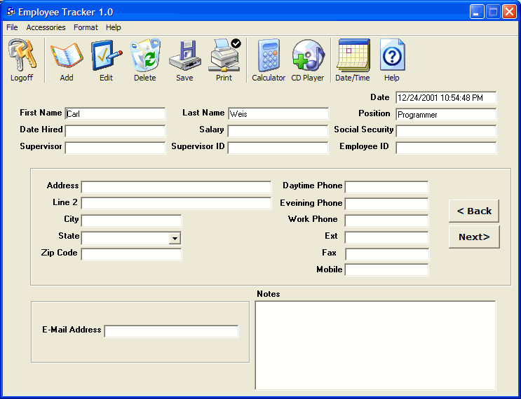



## Employee Tracker v1\.0

### Description

This is an excellent database program the screen shot speaks for itself has a lot off features. Basicly for storing and keeping track of employees. "PLEASE RATE IT IF YOU LIKE IT" it also has a custom CD Player built in. I will be uploading version 2.0 in 1 week so keep an eye out for it cause if you like this you'll love version 2.0. Still a littly buggy but it's still in its beta stage. Thanks PSC
 
### More Info
 

             |
---                |---
**Submitted On**   |2001-12-26 14:08:08
**By**             |[Karl Most](https://github.com/Planet-Source-Code/PSCIndex/blob/master/ByAuthor/karl-most.md)
**Level**          |Advanced
**User Rating**    |4.4 (35 globes from 8 users)
**Compatibility**  |VB 5\.0, VB 6\.0
**Category**       |[Databases/ Data Access/ DAO/ ADO](https://github.com/Planet-Source-Code/PSCIndex/blob/master/ByCategory/databases-data-access-dao-ado__1-6.md)
**World**          |[Visual Basic](https://github.com/Planet-Source-Code/PSCIndex/blob/master/ByWorld/visual-basic.md)
**Archive File**   |[Employee\_T4249212162001\.zip](https://github.com/Planet-Source-Code/karl-most-employee-tracker-v1-0__1-29798/archive/master.zip)

